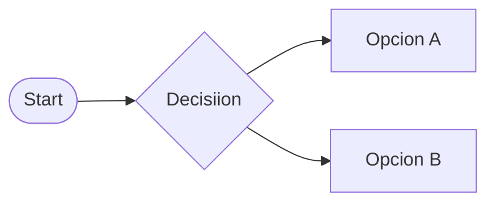

# POD

raw.githack.com


```mermaid
---
title: "Diagrama de Actividad UML - Autenticación con React, MUI y Firebase"
---
stateDiagram-v2
    [*] --> "Mostrar formulario de login (MUI)"
    "Mostrar formulario de login (MUI)" --> "Usuario ingresa email y contraseña"
    "Usuario ingresa email y contraseña" --> "Click en botón 'Iniciar sesión'"

    "Click en botón 'Iniciar sesión'" --> "Validar campos"
    "Validar campos" --> "Campos inválidos?" : Decisión

    "Campos inválidos?" --> "Mostrar error (MUI Alert)" : Sí
    "Mostrar error (MUI Alert)" --> "Esperar acción del usuario"
    "Campos inválidos?" --> "Llamar Firebase Auth" : No

    "Llamar Firebase Auth" --> "Validar credenciales (Firebase)"
    "Validar credenciales (Firebase)" --> "Credenciales válidas?" : Decisión

    "Credenciales válidas?" --> "Mostrar error (Snackbar MUI)" : No
    "Mostrar error (Snackbar MUI)" --> "Esperar acción del usuario"

    "Credenciales válidas?" --> "Obtener objeto de usuario" : Sí
    "Obtener objeto de usuario" --> "Guardar usuario en estado global (Context / Redux)"
    "Guardar usuario en estado global (Context / Redux)" --> "Redirigir a dashboard"
    "Redirigir a dashboard" --> "Renderizar componentes protegidos"
    "Renderizar componentes protegidos" --> [*]
```
