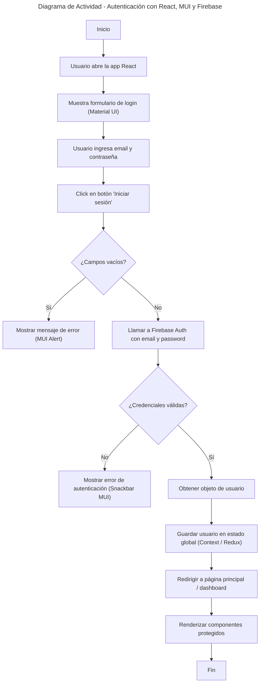

# POD

raw.githack.com

```mermaid
flowchart LR
A(["Start"])
A --> B{"Decisiion"}
B --> C["Opcion A"]
B --> D["Opcion B"]
``` 

```mermaid
---
title: "Diagrama de Actividad - Autenticación con React, MUI y Firebase"
---
flowchart TD

A["Inicio"] --> B["Usuario abre la app React"]
B --> C["Muestra formulario de login (Material UI)"]
C --> D["Usuario ingresa email y contraseña"]
D --> E["Click en botón 'Iniciar sesión'"]

E --> F{"¿Campos vacíos?"}
F -->|Sí| G["Mostrar mensaje de error (MUI Alert)"]
F -->|No| H["Llamar a Firebase Auth con email y password"]

H --> I{"¿Credenciales válidas?"}
I -->|No| J["Mostrar error de autenticación (Snackbar MUI)"]
I -->|Sí| K["Obtener objeto de usuario"]

K --> L["Guardar usuario en estado global (Context / Redux)"]
L --> M["Redirigir a página principal / dashboard"]

M --> N["Renderizar componentes protegidos"]
N --> O["Fin"]
```
